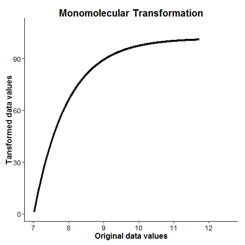
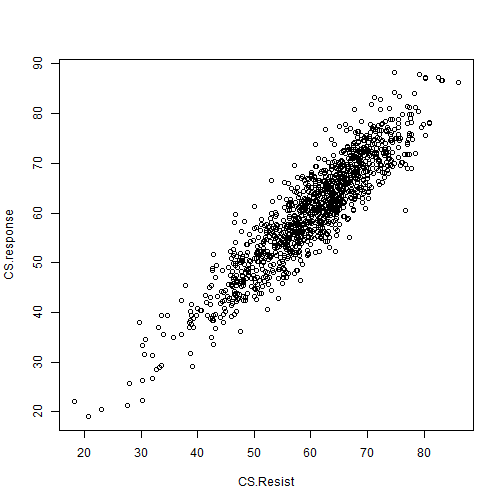

ResistanceGA: An R Package for Optimizing Resistance Surfaces using Genetic Algorithms
=====
Example Function Use
------
### Background

With this vignette/tutorial, hopefully you'll get an idea of what each of the functions in this package can do, as well present an example (using simulated data) of how one can optimize resistance surfaces in isolation as well as simultaneously to create novel resistance surfaces. This 'package' (I use that term very loosely) has largely been developed from functions I wrote to conduct different landscape genetic analyses. See [Peterman et al. (2014)](http://onlinelibrary.wiley.com/doi/10.1111/mec.12747/abstract "Published Molecular Ecology Study") for the original conception of optimizing resistance surfaces using optimization functions. This approach was limited to optimization of continuous surfaces in isolation. Since that paper, I've further developed the optimization method to utilize genetic algorithms, as implements using the `ga` function from the [GA package](http://cran.r-project.org/web/packages/GA/index.html "GA package, CRAN") in R. By moving to genetic algorithms, much more complex parameter space can be effectively searched, which allows for the optimization of categorical resistance surfaces, as well as optimization of multiple resistance surfaces simultaneously. 


This package fills a void in the landscape genetics toolbox. There are various methods proposed for determining resistance values (reviewed by [Spear et al., 2010](http://onlinelibrary.wiley.com/doi/10.1111/j.1365-294X.2010.04657.x/abstract "Spear et al.")). Previously utilized methods generally searched a limited parameter space and/or relied on expert opinion. [Graves et al. (2013)](http://onlinelibrary.wiley.com/doi/10.1111/mec.12348/abstract "Graves et al.") utilized optimization functions and interindividual genetic distances to determine resistance values, but found that the data generating values were rarely recoverable. I have not assessed the ability of functions/methods utilized in this package to optimize resistance surfaces as in Graves et al. (2013), but do note that very different methods of scaling, transforming, and combining resistance surfaces are utilized in `ResistanceGA`.


A few words of caution. I have made every effort to run and test each function with simulated data, but I make no guarantees concerning function performance and stability. Data formatting can be a challenge, and I have tried to simplify the process as much as possible. If errors occur, start by making sure that you are providing function inputs in the correct format. If a function does not work, there likely will not be a helpful error message to help you troubleshoot. Depending on interest and use, these are features that may be added in the future. Hopefully this tutorial will help with that process. Lastly, this is not a fast process. Even with the 80x80 pixel simulated landscapes used in this tutorial, each optimization iteration takes 0.75--1.25 seconds to complete (Intel i7 3.4 GHz processor, 24 GB RAM). The largest surfaces I've attempted to optimize using these methods were 600x600 pixels, which took ~13 seconds per iteration. Depending upon whether you are optimizing a single surface or multiple surfaces simultaneously, the genetic algorithms typically run for 50--150 generations. `ga` settings will vary for each run, but there will typically be 50--150 offspring (i.e. different parameter value realizations) per generation. This means that 2500--2.25 &times; 10<sup>4</sup> iterations will be needed to complete the optimization. This can be a **LONG** process! If you encounter issues while executing any of these functions, or would like some other functionality incorporated, please let me know (<bill.peterman@gmail.com>). I eager to make this as accessible, functional, and useful as possible, so any and all feedback is appreciated.


**References**   
* Graves, T. A., P. Beier, and J. A. Royle. 2013. Current approaches using genetic distances produce poor estimates of landscape resistance to           &nbsp;&nbsp;&nbsp;&nbsp;&nbsp;interindividual dispersal. Molecular Ecology 22:3888--3903.
* Peterman, W. E., G. M. Connette, R. D. Semlitsch, and L. S. Eggert. in press. Ecological resistance surfaces predict fine scale genetic     
&nbsp;&nbsp;&nbsp;&nbsp;&nbsp;differentiation in a terrestrial woodland salamander. Molecular Ecology:10.1111/mec.12747.    
* Spear, S. F., N. Balkenhol, M. J. Fortin, B. H. McRae, and K. Scribner. 2010. Use of resistance surfaces for landscape genetic studies:     
&nbsp;&nbsp;&nbsp;&nbsp;&nbsp;considerations for parameterization and analysis. Molecular Ecology 19:3576--3591.


Example Function Use
------
### Single surface optimization

**Simulate data**

Load the required R packages, clear your workspace, and set a random number seed. The `RandomFields` package will be used to simulate resistance surfaces. The `ResistanceGA` package requires the `raster`, `plyr`, `GA`, `lme4` (>= 1.0), and `ggplot2` packages


```r
require(RandomFields)
require(ResistanceGA)

rm(list = ls())
set.seed(12345)
```


Next, make a directory to write where ASCII files, CIRCUITSCAPE batch files, and results will be written. I'm going to make a directory called 'ResistanceGA_Example' to work in


```r
if ("ResistanceGA_Examples" %in% dir("C:/") == FALSE) dir.create(file.path("C:/", 
    "ResistanceGA_Examples"))

# Create a subdirectory for the first example
dir.create(file.path("C:/ResistanceGA_Examples/", "SingleSurface"))

write.dir <- "C:/ResistanceGA_Examples/SingleSurface/"  # Directory to write .asc files and results
```


Define the data simulation parameters:

```r
r.dim <- 60  # number of cells on a side
cell.size <- 0.025  # raster cell dimension     
min.point <- 0.2 * (r.dim * cell.size)  # minimum coordinate for generating random points (multiplied by 0.25 to prevent edge effects)
max.point <- (r.dim * cell.size) - min.point  # maximum coordinate for generating random points

# Number of 'Sample locations' to generate. This example will generate
# points on a square grid, so choose a number that has an even square root
n <- 49

x <- seq(from = min.point, max.point, by = cell.size)  # set x & y range to draw random samples from
y <- seq(from = min.point, max.point, by = cell.size)
xy <- cbind(x, y)
xy.coords <- SpatialPoints(xy)
Sample.coord <- spsample(Spatial(bbox = bbox(SpatialPoints(xy))), n, type = "regular")  # Generate regularly spaced points on a grid
coord.id <- cbind((1:n), Sample.coord@coords)  # Combine location ID with coordinates

# Write the table to a file. This is formatted for input into CIRCUITSCAPE
write.table(coord.id, file = paste0(write.dir, "samples.txt"), sep = "\t", col.names = F, 
    row.names = F)
```


Using random fields, create one continuous resistance surface

```r
model <- RMexp() + RMtrend(mean = 10)

grid.vars <- GridTopology(cellcentre.offset = c(cell.size/2, cell.size/2), cellsize = c(cell.size, 
    cell.size), cells.dim = rep(r.dim, 2))

rf.sim <- RFsimulate(model, x = grid.vars)

cont.rf <- raster(rf.sim[1])  # Define object as a continuous surface
names(cont.rf) <- "cont"
```

Plot surface and overlay the sample points

```r
plot(cont.rf)
plot(Sample.coord, pch = 16, col = "blue", add = TRUE)  # Add randomly generated points
```

 

Export the raw continuous surface to a .asc file for use with CIRCUITSCAPE

```r
writeRaster(cont.rf, filename = paste0(write.dir, "cont.asc"), overwrite = TRUE)
```

```
## class       : RasterLayer 
## dimensions  : 60, 60, 3600  (nrow, ncol, ncell)
## resolution  : 0.025, 0.025  (x, y)
## extent      : 0, 1.5, 0, 1.5  (xmin, xmax, ymin, ymax)
## coord. ref. : NA 
## data source : C:\ResistanceGA_Examples\SingleSurface\cont.asc 
## names       : cont
```


**Prepare data for optimization**   
Run the `GA.prep` and `CS.prep` functions

```r
GA.inputs <- GA.prep(ASCII.dir = write.dir, pop.mult = 5, min.cat = 0, max.cat = 500, 
    max.cont = 500, run = 1)
# Note that the default value for run is 25. It is set to 1 for
# demonstration only. THIS WILL NOT OPTIMIZE!

CS.inputs <- CS.prep(n.POPS = n, CS_Point.File = paste0(write.dir, "samples.txt"), 
    CS.exe = paste("\"C:/Program Files/Circuitscape/4.0/cs_run.exe\""))
```

Note that `RESPONSE` was not defined in `CS.prep` because it has not been made yet.

Transform raw continuous surface using the `Resistance.tran` function to apply one of the six transformations, and then view the transformation using `PLOT.trans`. Note that `PLOT.trans` returns a `ggplot2` object as well as the plot. Therefore you can manipulate and modify the plot as desired.

```r
r.tran <- Resistance.tran(transformation = "Monomolecular", shape = 2, max = 100, 
    CS.inputs = CS.inputs, r = cont.rf)


plot.t <- PLOT.trans(PARM = c(2, 100), Resistance = "C:/ResistanceGA_Examples/SingleSurface/cont.asc", 
    transformation = "Monomolecular")
```

 


Run the transformed resistance surface through CIRCUITSCAPE to get effective resistance between each pair of points. `Run.CS` returns the lower half of the pairwise resistance matrix for use with the optimization prep functions. We will add some random noise to the resistance values prior to optimization.
 


Rerun `CS.prep` including the newly created `CS.Response`

```r
CS.inputs <- CS.prep(n.POPS = n, RESPONSE = CS.response, CS_Point.File = paste0(write.dir, 
    "samples.txt"), CS.exe = paste("\"C:/Program Files/Circuitscape/4.0/cs_run.exe\""))
```


Now run the Single surface optimization function (`SS_optim`)

```r
SS_optim(CS.inputs = CS.inputs, GA.inputs = GA.inputs)
```

```
## Error: unused argument (equation = EQ)
```

After executing the function, the console will be updated to report the time to complete each iteration as well as AICc of each iteration. 

What the `SS_optim` function does:
1. Read each .asc file that is in the specified ASCII.dir, and determines whether it is a categorical or continuous surface. A surface is considered categorical if it contains 15 or fewer unique values.
2. Optimize each resistance surface
  * Categorical surfaces: The first category/factor is set to a resistance value of 1. All other categories are then adjusted, ranging from the minimum--maximum specified during the `GA.prep`. It is necessary to fix the value of one category, otherwise numerous equivalent solutions may make optimization intractable (e.g. resistance values of 1, 5, & 10 would have the same relative resistance as 2, 10, & 20)
  * Continuous surfaces: Each continuous surface is first rescaled so that values range from 0--10 (note that the relative differences are preserved during rescaling). The genetic algorithm then tests different combinations of transformation equation, shape parameter value, and maximum resistance value. When the genetic algorithm has finished optimization, the optimized parameters are passed to a second optimization function that used `nlm` to fine-tune the shape and maximum value parameters.
3. Several summary outputs are generated
  * In the 'Results' directory (located in the directory with the .asc files), a final optimized resistance .asc file has been made, along with the CIRCUITSCAPE results (.out files).
  * Summary tables for continuous surfaces (ContinuousResults.csv), categorical surfaces (CategoricalResults.csv), and the AICc of all surfaces (All_Results_AICc.csv)
  * MLPE_coeff_Table.csv contains the model coefficients from the fitted mixed effects model for each surface
  * In the 'Plots' directory is a 4-panel figure with different model diagnostic plots generated from the fitted mixed effects model of each optimized resistance surface. If a continuous surface was optimized, there is also a plot showing the relationship of the transformed resistance surface with the original data.
    


