```{r setup, include=FALSE}
knitr::opts_chunk$set(echo = TRUE)
```

```{r, echo = FALSE}
library(ggplot2, warn.conflicts = F, quietly = T)
library(raster, warn.conflicts = F, quietly = T)
```

ResistanceGA
=====
An R Package for Optimizing Resistance Surfaces using Genetic Algorithms
------
### Background

With this vignette/tutorial, hopefully you'll get an idea of what each of the functions in this package can do, as well present an example (using simulated data) of how you can optimize resistance surfaces in isolation as well as simultaneously to create novel resistance surfaces. This 'package' (I use that term very loosely) has largely been developed from functions I wrote to conduct different landscape genetic analyses. See [Peterman et al. (2014)](http://onlinelibrary.wiley.com/doi/10.1111/mec.12747/abstract "Published Molecular Ecology Study") for the original conception of optimizing resistance surfaces using optimization functions. This approach was limited to optimization of continuous surfaces in isolation. Since that paper, I've further developed the optimization method to utilize genetic algorithms, implemented using the `ga` function from the [GA package](http://cran.r-project.org/web/packages/GA/index.html "GA package, CRAN") in R. By moving to genetic algorithms, much more complex parameter space can be effectively searched, which allows for the optimization of categorical resistance surfaces, as well as optimization of multiple resistance surfaces simultaneously. 


This package fills a void in the landscape genetics toolbox. There are various methods proposed for determining resistance values (reviewed by [Spear et al., 2010](http://onlinelibrary.wiley.com/doi/10.1111/j.1365-294X.2010.04657.x/abstract "Spear et al.")). Previously utilized methods generally searched a limited parameter space and/or relied on expert opinion. [Graves et al. (2013)](http://onlinelibrary.wiley.com/doi/10.1111/mec.12348/abstract "Graves et al.") utilized optimization functions and interindividual genetic distances to determine resistance values, but found that the data generating values were rarely recoverable. I have not assessed the ability of functions/methods utilized in this package to optimize resistance surfaces as in Graves et al. (2013), but do note that very different methods of scaling, transforming, and combining resistance surfaces are utilized in `ResistanceGA`.     

A few words of caution. I have made every effort to run and test each function with simulated data, but I make no guarantees concerning function performance and stability. Data formatting can be a challenge, and I have tried to simplify the process as much as possible. If you choose to optimize using CIRCUITSCAPE, please make sure you carefully read through the [CIRCUITSCAPE](http://www.circuitscape.org/home "CIRCUITSCAPE") documentation, as well as other relevant papers by [Brad McRae](http://www.circuitscape.org/pubs "McRae papers") to get a more complete understanding of resistance modeling and circuit theory. If errors occur, start by making sure that you are providing function inputs in the correct format. If a function does not work, there likely will **not** be a useful error message to help you troubleshoot. Depending on interest and use, these are features that may be added in the future. Lastly, this is not a fast process. Even with the 50x50 pixel simulated landscapes used in this tutorial, each (CIRCUITSCAPE) optimization iteration takes 0.75--1.00 seconds to complete (Intel i7 3.6 GHz processor, 24 GB RAM). As of version 3.0-4, it is possible to optimize using the `commuteDistance` function of `gdistance`. This approach is functionally equivalent to CIRCUITSCAPE [Kivimäki et al., 2014](https://doi.org/10.1016/j.physa.2013.09.016 "Kivimäki et al."), is slightly faster, and allows the optimization algorithm to be run in parallel. Optimizing using least cost paths is ~3x faster than with CIRCUITSCAPE, optimization with commute-time distance is ~2x faster (although processing times for CIRCUITSCAPE and `commuteDistance` converge for larger landscapes [e.g., > 1 million pixels]). To further reduce optimization time when using least cost paths or commute-time distance, the optimization can be run in parallel. This will effectively reduce optimization time by the number of cores used for optimization. It appears that under most circumstances the resolution of the landscape can be reduced without loss of information ([McRae et al., 2008](http://www.esajournals.org/doi/abs/10.1890/07-1861.1 "McRae et al.")).      

As of version 3.0-1, it is possible to optimize with CIRCUITSCAPE on Linux, which allows for CIRCUITSCAPE to be run in parallel. This may reduce optimization times when working with large landscapes. Depending upon whether you are optimizing a single surface or multiple surfaces simultaneously, the genetic algorithms typically run for 50--300 generations. `ga` settings will vary for each run, but there will typically be 50--150 offspring (i.e. different parameter value realizations) per generation. This means that 2,500--45,000 iterations will be needed to complete the optimization. This can be a **LONG** process! If you encounter issues while executing any of these functions, or would like some other functionality incorporated, please let me know (<bill.peterman@gmail.com>). I am eager to make this as accessible, functional, and as useful as possible, so any and all feedback is appreciated.     


**References**   
* Graves, T. A., P. Beier, and J. A. Royle. 2013. Current approaches using genetic distances produce poor estimates of landscape resistance to interindividual dispersal. Molecular Ecology 22:3888--3903.    

* Kivimäki, I., M. Shimbo, and M. Saerens. 2014. Developments in the theory of randomized shortest paths with a comparison of graph node distances. Physica A: Statistical Mechanics and its Applications 393:600-–616.

* McRae, B. H., B. G. Dickson, T. H. Keitt, and V. B. Shah. 2008. Using circuit theory to model connectivity in ecology, evolution, and conservation. Ecology 89:2712--2724.     

* Peterman, W. E., G. M. Connette, R. D. Semlitsch, and L. S. Eggert. in press. Ecological resistance surfaces predict fine scale genetic 
differentiation in a terrestrial woodland salamander. Molecular Ecology 23:2402--2413.    

* Spear, S. F., N. Balkenhol, M. J. Fortin, B. H. McRae, and K. Scribner. 2010. Use of resistance surfaces for landscape genetic studies: considerations for parameterization and analysis. Molecular Ecology 19:3576--3591.        

* Ruiz-Lopez, M. J., C. Barelli, F. Rovero, K. Hodges, C. Roos, W. E. Peterman, and N. Ting. 2016. A novel landscape genetic approach demonstrates the effects of human disturbance on the Udzungwa red colobus monkey (_Procolobus gordonorum_). Heredity 116:167–176.    


Thoughts on Optimization
------
There are three options for objective functions that can be used when optimizing resistance surfaces with `ResistanceGA`: (1) AIC, (2) conditional R^2^, or (3) log-likelihood. By default (as of version 3.0-4), the default is to optimize using seeks to optimize using log-likelihood as the objective function. Given that the overall goal of a landscape genetics analysis is to assign resistance values that best explain genetic differentiation, it seems sensible to use R^2^. However, R^2^ seems not to be a sensitive enough to allow the optimization procedure to reliably progress. Previously, AICc was used as the objective function, but it is not clear how best to determine the sample size when calculating AICc. Prior to version 3.0-0, the number of pairwise comparisons was used as the sample size. Now, sample size is equivalent to the number of populations inlcuded in your analysis. This is much more conservative, and increases in model complexity are more drastically penalized. On the topic of model complexity, this is also not a cut-and-dry assessment. __All__ the mixed effects models take the form:

\begin{equation}
Y_{ij} = \alpha + \beta(X_{ij} - x) + \tau_i + \tau_j + e_{ij}, \qquad j=2, .... n; \quad i = 1, ..., j-1, 
\end{equation}

which is the maximum liklihood population effects parameterization (see [Clarke et al., 2002](http://link.springer.com/article/10.1198%2F108571102320 "Clarke et al.")). Because there is only ever a single independent variable (the vector of pairwise transformed resistance values), all models technically have the same number of parameters (_i.e. k_ = 2). However, multiple values were optimized to create these resistance values. For continuous surfaces there is a shape and a scale parameter in addition to the intercept (_k_ = 3), while each category within a categorical surface is estimated (_k_ = number of categories + 1). When multiple surfaces are optimized simultaneously, a single composite resistance is created. It is not possible to have each of these surfaces assessed as separate indpendent variables because of high multicollinearity among surfaces that occurs during optimization. _k_ in multisurface models is determined as the sum of all estimated parameters plus 1 (intercept). __Again, there are no guidelines for how to determine *n* or *k* in these models. Use your best judgement and clearly articulate and justify your methods__.

Becasue of this uncertainty, it is now also possible to specify how _k_ is determined: (1) _k_ = the number of parameters in the in mixed effects model (i.e. 2); (2) _k_ = the total number of parameteers optimized plus the intercept; (3) _k_ = the total number of parameters optimized, plus the number of layers and the intercept. The method for evaluating _k_ and the objective function to use during optimization can both be specified in the `GA.prep` function.     

Setup
------
### Install necessary software and packages
If you want to optimize using CIRCUITSCAPE, this package requires that you have [CIRCUITSCAPE v4.0](http://www.circuitscape.org/downloads "CS Downloads") or higher installed on your Windows machine. At this point in time, `ResistanceGA` can only execute CIRCUITSCAPE on *WINDOWS* operating systems. You will also need to have [R >= v3.0](http://www.r-project.org/ "R downloads") installed. I would highly recommend installing [R studio](https://www.rstudio.com/ide/download/ "R Studio download") when working with R.     

__Because it has now been determined that `commuteDistance` is equivalent to CIRCUITSCAPE, it is highly recommended to to conduct all optimizations using this approach, run in parallel. Doing do allows for all processes to be conducted within R, and will not require execution of software outside of the R environment. If final current flow maps are desired, these can still be generated using the optimized resistance surface using CIRCUITSCAPE.__     


### Running on Linux
To run CIRCUITSCAPE on Linux (tested with Ubuntu 16.04):    
1.  Install CIRCUITSCAPE---Default installation directory is `/usr/local/bin/csrun.py`   
2. To call CIRCUITSCAPE from R, first change file permissions from the command line terminal (shortcut: control + alt+ t) ` sudo chomod 755 /usr/local/bin/csrun.py `  
    * This will allow `csrun.py` to be executed without specifying paths.   
    
*If you can provide code of how to run CIRCUITSCAPE from R, I will work to implement it*

*R Packages*    
This package consists of several wrapper functions for implementing functions from other packages, and these will all be imported when `ResistanceGA` is installed.  

### Installation

First, install `ResistanceGA` from GitHub. This will require the `devtools` package
```{r install.package, eval=FALSE}
# Install 'devtools' package, if needed
if(!("devtools" %in% list.files(.libPaths()))) {
    install.packages("devtools", repo = "http://cran.rstudio.com", dep = TRUE) 
}

# Download package, build vignette
devtools::install_github("wpeterman/ResistanceGA", 
                         build_vignettes = TRUE) 
```

Load `ResistancaGA` and clear your workspace.
```{r results='hide',message=FALSE, warning=FALSE}
library(ResistanceGA)
rm(list = ls())
```

Demonstrations
------
### Continuous surface transformations

There are 8 different transformations that can be applied to continuous surfaces. Since the publication of Peterman et al. (2014), I have added Reverse Ricker and Inverse-Reverse Ricker transformation to better cover parameter space. I still think that there are more flexible ways to optimize surfaces, and I'm continuing to develop these as I have time.   
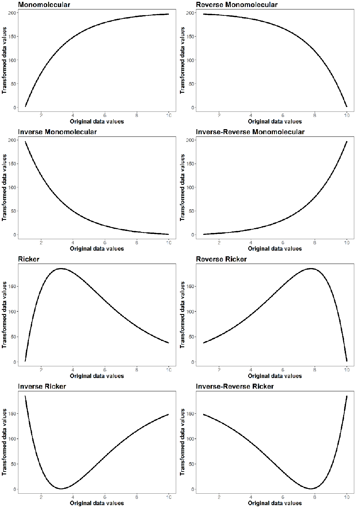\

All of these figures were made with the `Plot.trans` function. This function returns a ggplot object, which allows you to manipulate some aspects of the plot, as well as determine the resistance value at different levels of your original surface.
```{r Plot.trans.demo, fig.height = 4, fig.width = 4}
Ricker.plot <- Plot.trans(PARM = c(1.5, 200),
                          Resistance = c(1,10),
                          transformation="Ricker")

# Change title of plot
Ricker.plot$labels$title <- "Ricker Transformation"
Ricker.plot

# Find original data value that now has maximum resistance
Ricker.plot$data$original[which(Ricker.plot$data$transformed==max(Ricker.plot$data$transformed))]
```


Example Function Use
------
### Single surface optimization

Make a directory to write ASCII files, CIRCUITSCAPE batch files, and results. It is critical that there are **NO SPACES** in the specified directory as this will cause functions that interact with CIRCUITSCAPE to fail.  
```{r warning=FALSE, results='hide',message=FALSE, eval=FALSE}
 
if("ResistanceGA_Examples"%in%dir("C:/")==FALSE) 
  dir.create(file.path("C:/", "ResistanceGA_Examples")) 

# Create a subdirectory for the first example
dir.create(file.path("C:/ResistanceGA_Examples/","SingleSurface")) 

# Directory to write .asc files and results
write.dir <- "C:/ResistanceGA_Examples/SingleSurface/"      

# Give path to CIRCUITSCAPE .exe file
# Default = '"C:/Program Files/Circuitscape/cs_run.exe"'
CS.program <- paste('"C:/Program Files/Circuitscape/cs_run.exe"')
```

```{r load.data, echo = FALSE, message = FALSE, warning=FALSE}
data(resistance_surfaces)
continuous <- resistance_surfaces[[2]]
data(samples)
sample.locales <- SpatialPoints(samples[,c(2,3)])
```

Load resistance surfaces and export as *.asc* file for use with CIRCUITSCAPE. These surfaces were made using the `RandomFields` package
```{r eval=FALSE}
data(resistance_surfaces)
continuous <- resistance_surfaces[[2]]
writeRaster(continuous,
            filename = paste0(write.dir,"cont.asc"),
            overwrite = TRUE)
```

Load the example sample location data and export as *.txt* file. This is formatted for input into CIRCUITSCAPE
```{r eval=FALSE}
data(samples)
write.table(samples,file=paste0(write.dir,"samples.txt"),sep="\t",col.names=F,row.names=F)

# Create a spatial points object for plotting
sample.locales <- SpatialPoints(samples[,c(2,3)])
```

Plot surface and overlay the sample points
```{r single.surface.plot, fig.height = 4, fig.width = 4}
plot(continuous)
plot(sample.locales, pch = 16, col = "blue", add = TRUE) # Add points
```


## Prepare data for optimization   
Run the `GA.prep` and `CS.prep` functions
```{r eval=FALSE}
# Set the random number seed to reproduce the results presented
GA.inputs <- GA.prep(ASCII.dir = write.dir,
                     max.cat = 500,
                     max.cont = 500,
                     select.trans = "M",
                     method = "LL"
                     seed = 555) 

CS.inputs <- CS.prep(n.Pops = length(sample.locales),
                   CS_Point.File = paste0(write.dir,"samples.txt"),
                   CS.program = CS.program) 
```
Note that `response` was not defined in `CS.prep` because it has not been made yet. When doing an actual analysis (not a simulation, as in this example) you will specify your pairwise genetic distance data as the response.     

`select.trans` allows you to specify which transformations can be applied to a surface during optimization. "A" = All; "M" = Monomolecular only; "R" = Ricker only. By default, all transformations will be assessed when a continuous surface is optimized. See `GA.prep` documentation for more details. In this example, we are constraining the genetic algorithm to only consider Monomolecular transformations. In an actual analysis, such a constraint may or may not be desired.     

Transform the raw continuous surface using the `Resistance.tran` function to apply one of the eight transformations, and then view the transformation using `Plot.trans`. Note that `Plot.trans` returns a `ggplot2` object as well as the plot. Therefore you can manipulate and modify the plot as desired.
```{r monomolec.plot, eval = FALSE}
r.tran <- Resistance.tran(transformation = "Monomolecular", 
                          shape = 2, 
                          max = 275, 
                          r = continuous) 

plot.t <- Plot.trans(PARM = c(2, 275), 
                     Resistance = continuous, 
                     transformation = "Monomolecular") 
```

Run the transformed resistance surface through CIRCUITSCAPE to get effective resistance between each pair of points. `Run.CS` returns the lower half of the pairwise resistance matrix for use with the optimization prep functions. This will be our response that we optimize on.
```{r eval=FALSE}
# Create the true resistance/response surface
CS.response <- Run_CS(CS.inputs = CS.inputs,
                      GA.inputs = GA.inputs,
                      r = r.tran)
```

Rerun `CS.prep` including the newly created `CS.response`
```{r eval=FALSE}
CS.inputs <- CS.prep(n.Pops = length(sample.locales),
                   response = CS.response,
                   CS_Point.File = paste0(write.dir,"samples.txt"),
                   CS.program = CS.program)
```

Run the Single surface optimization function (`SS_optim`). Running this example with the default settings
took 147 iterations and ~72 minutes to complete on a computer with an Intel i7 3.6 GHz processor. The data generating values have been precisely recovered.   
```{r eval=FALSE}
SS_RESULTS <- SS_optim(CS.inputs=CS.inputs,
                       GA.inputs=GA.inputs)
```

View the results and compare with truth   
```
SS_table <- data.frame(c("Monomolecular", 2.0, 275),
                        t(SS_RESULTS$ContinuousResults[c(3:5)]))
colnames(SS_table) <- c("Truth", "Optimized")

SS_table
                 Truth     Optimized
Equation Monomolecular Monomolecular
shape                2      1.999999
max                275      274.9982
```

If you get the error:
```
Error in initializePtr() : 
  function 'dataptr' not provided by package 'Rcpp'
```
Reinstall the `Rcpp` package and execute the `SS_optim` function again.

After executing the function, the console will be updated to report the time to complete each iteration as well as AICc of each iteration. If you do not wish to view updates at each iteration of the optimization, set `quiet = TRUE` in `GAp.prep`


What the `SS_optim` function does:       
* Read each .asc file that is in the specified ASCII.dir and determines whether it is a categorical or continuous surface. A surface is considered categorical if it contains 15 or fewer unique values.   
* Optimize each resistance surface   
 * Categorical surfaces: Each optimized value represents the resistance of that category to current flow   
 * Continuous surfaces: Each continuous surface is first rescaled so that values range from 0--10 (note that relative spacing is preserved during rescaling). The genetic algorithm then tests different combinations of the transformation equation, shape parameter value, and maximum resistance value. When the genetic algorithm has finished optimization, the optimized parameters can be passed to a second optimization function that uses `nlm` to fine-tune the shape and maximum value parameters (`nlm = TRUE`). However, this approach may lead to overfitting and the default is `nlm = FALSE`.   
* Several summary outputs are generated   
 * In the 'Results' directory (located in the directory with the .asc files), a final optimized resistance .asc file has been made, along with the CIRCUITSCAPE results (.out files).   
 * Summary tables for continuous surfaces (ContinuousResults.csv), categorical surfaces (CategoricalResults.csv), and the objective function value for all surfaces (All_Results_AICc.csv)   
 * MLPE_coeff_Table.csv contains the model coefficients from the fitted mixed effects model for each surface   
 * In the 'Plots' directory there is a 4-panel figure with different model diagnostic plots generated from the fitted mixed effects model of each optimized resistance surface. If a continuous surface was optimized, there is also a plot showing the relationship of the transformed resistance surface with the original data.   
* The returned object is a named list containing the tables described above.      
  

### Minimum code for running ResistanceGA
The example above outlines how the functions can be used while simulating and generating data with known parameter values. When analyzing your own data, it is not necessary to to use the `r.tran` or `Run_CS` functions. You should only have to use the following functions (although you may want to change settings from defaults).
```{r eval=FALSE}
GA.inputs <- GA.prep(ASCII.dir = write.dir) 

CS.inputs <- CS.prep(n.Pops = length(sample.locales),
                     response = CS.response,
                     CS_Point.File = paste0(write.dir,"samples.txt"),
                     CS.program = CS.program)

SS_RESULTS <- SS_optim(CS.inputs = CS.inputs,
                       GA.inputs = GA.inputs)
```

## Optimization with CIRCUITSCAPE on Linux platform
Gains in optimization speed when using CIRCUITSCAPE can be achieved in two ways when using Linux:
1.  Run the genetic algorithm in parallel (in the `GA.prep` function set `parallel = X` where 'X' is the number of cores to use).     
2.  In the `CS.prep` function, set `parallel = TRUE` and specify `cores` to the number of cores for CIRCUITSCAPE to use when quantifying current flow across a surface.          


## Optimzation using `costDistance` (least cost paths) and `commuteDistance` (equivalent to CS resistance distance)
The above optimization can also be done using functions in `gdistance`. This approach uses least cost paths or random walk commute times between points.  Optimization using `gdistance` can be substantially faster than optimization with CIRCUITSCAPE. This optimization took 49 iterations and 4 minutes to complete when run in parallel on 4 cores (`parallel = 4` in `GA.prep`). To demonstrate the equivalence of CIRCUITSCAPE and `commuteDistance`, the simulation below uses the CIRCUITSCAPE resistance distances generated above as the response.
```{r gdistance, eval=FALSE}
# Import data
data(resistance_surfaces)
continuous <- resistance_surfaces[[2]]

data(samples)
sample.locales <- SpatialPoints(samples[,c(2,3)])

# Set the random number seed to reproduce the results presented
# Run in parallel on 4 cores
GA.inputs <- GA.prep(ASCII.dir=continuous,
                     Results.dir=write.dir,
                     select.trans = "M",
                     max.cat=500,
                     max.cont=500,
                     seed = 555,
                     parallel = 4) 


gdist.inputs <- gdist.prep(length(sample.locales),
                           samples = sample.locales,
                           response = CS.response,
                           method = 'commuteDistance') ## Optimize using commute distance

# Run optimization
SS_RESULTS.gdist <- SS_optim(gdist.inputs = gdist.inputs,
                             GA.inputs = GA.inputs)
```


Now compare the results from optimization with CIRCUITSCAPE and optimization with `commuteDistance` 
```
SS_table <- data.frame(c("Monomolecular", 2.0, 275),
                        t(SS_RESULTS$ContinuousResults[c(9:11)]),
                        t(SS_RESULTS.gdist$ContinuousResults[c(9:11)]))
colnames(SS_table) <- c("Truth", "CS.Optimized", "commuteDist.Optimized")

SS_table
                 Truth     CS.Optimized   commuteDist.Optimized
Equation Monomolecular    Monomolecular           Monomolecular
shape                2        1.999999                1.999504
max                275        274.9982                277.0668

```


To view the response surface for the Monomolecular optimization of this surface, you can run `Grid.Search`. This function is only relevant for single continuous surfaces.
```{r eval=FALSE}
Grid.Results <- Grid.Search(shape = seq(1, 3, by = 0.025),
                            max = seq(125, 425, by = 50),
                            transformation = "Monomolecular",
                            Resistance = continuous, 
                            gdist.inputs = gdist.inputs, 
                            GA.inputs = GA.inputs)
```
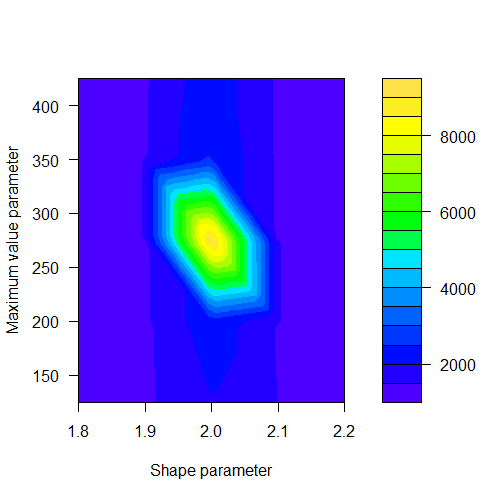    \  

You can change the color scheme and color breaks by manually recreating the response surface from the generated data [default = topo.colors(20)]
```{r recreate.grid, eval=FALSE}
filled.contour(Grid.Results$Plot.data,
               col = rainbow(14),
               xlab = "Shape parameter",
               ylab = "Maximum value parameter")
```
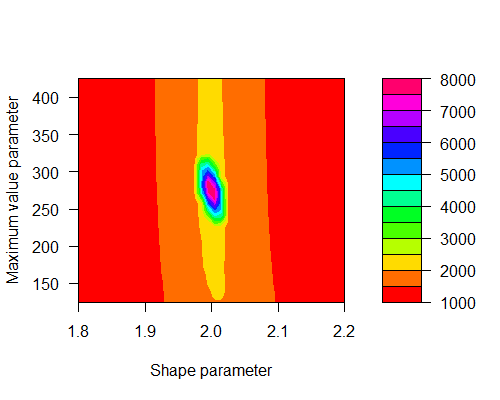   \ 

Note that actual response surfaces tend to be slightly flatter, and the maximum value for a single surface is more difficult to identify precisely. If you were to add some random noise to the CS.response, the single surface optimization generally would do a good job of recovering the transformation and shape parameters, but the true maximum value may remain elusive. Occasionally the algorithm will get 'stuck' trying to optimize on an incorrect transformation. If this happens, rerun the optimization. Of course, you may not know that a surface wasn't correctly optimized when using real data. For this reason, it is good practice to run all optimizations at least twice to confirm parameter estimates. 

 ****
## Simultaneous optimization of multiple surfaces

First, make a new directory to write ASCII files, CIRCUITSCAPE batch files, and results.
```{r warning=FALSE, results='hide',message=FALSE, eval=FALSE}
if("ResistanceGA_Examples"%in%dir("C:/")==FALSE) 
  dir.create(file.path("C:/", "ResistanceGA_Examples")) 

# Create a subdirectory for the second example
dir.create(file.path("C:/ResistanceGA_Examples/","MultipleSurfaces")) 

# Directory to write .asc files and results
write.dir <- "C:/ResistanceGA_Examples/MultipleSurfaces/"      
```

Extract other resistance surfaces from the 'resistance_surfaces' raster stack
```{r multi_surface.sim, warning=FALSE, message=FALSE,results='hide'}
data(resistance_surfaces)
data(samples)
sample.locales <- SpatialPoints(samples[ ,c(2,3)])
```

Visualize each surface:
```{r feature.sim, warning=FALSE,message=FALSE, fig.height = 4, fig.width = 4}
plot(resistance_surfaces[[1]],main = resistance_surfaces[[1]]@data@names)
plot(sample.locales, pch=16, col="blue", add=TRUE)
plot(resistance_surfaces[[2]],main = resistance_surfaces[[2]]@data@names)
plot(sample.locales, pch=16, col="blue", add=TRUE)
plot(resistance_surfaces[[3]],main = resistance_surfaces[[3]]@data@names)
plot(sample.locales, pch=16, col="blue", add=TRUE)
```

Create a raster stack and run the `GA.prep` function (needed to combine surfaces). In this example, the genetic algorithm will seek to maximize the log likelihood of the fitted model (`method = "LL"`).
```{r eval=FALSE}
# Note that the `resistance_surfaces` is already a RasterStack object. 
# The code below for demonstration of how to make a stack.
r.stack <- stack(resistance_surfaces$categorical,
                 resistance_surfaces$continuous,
                 resistance_surfaces$feature)

GA.inputs <- GA.prep(ASCII.dir = r.stack,
                     Results.dir = write.dir,
                     method = "LL",
                     max.cat = 500,
                     max.cont = 500,
                     seed = 555,
                     parallel = 4) 

gdist.inputs <- gdist.prep(length(sample.locales),
                           samples = sample.locales,
                           method = 'commuteDistance') # Optimize using commute distance

```

Transform, reclassify, and combine the three resistance surfaces together. Use an "Inverse-Reverse Monomolecular" transformation of the continuous surface. Visualize this transformation using `Plot.trans`. The first value of `PARM` refers to the shape parameter, and the second value refers to the maximum value parameter. Look in the help file for `Plot.trans` for transformation names/numbers.
```{r IR_Mono, eval=FALSE }
plot.t <- Plot.trans(PARM = c(3.5, 150),
                     Resistance = continuous,
                     transformation = "Inverse-Reverse Monomolecular") 
```
\

Combine raster surfaces together using `Combine_Surfaces`. Note that the .asc files are read in alphabetically (if stored in a directory), or else imported in the order tehy occur in the raster stack. You can check the order of surfaces by inspecting `GA.inputs$layer.names`. First, define the parameters that will be passed to `Combine_Surfaces`.   
```{r combine.surfaces, eval=FALSE}
PARM <- c(1, 250, 75, 1, 3.5, 150, 1, 350)

# PARM<- c(1,   # First feature of categorical   
#          250, # Second feature of categorical   
#          75,  # Third feature of categorical     
#          1,   # Transformation equation for continuous surface = Inverse-Reverse Monomolecular   
#          3.5,   # Shape parameter    
#          150, # Scale parameter 
#          1,   # First feature of feature surface    
#          350) # Second feature of feature surface   

# Combine resistance surfaces
Resist <- Combine_Surfaces(PARM = PARM, 
                           gdist.inputs = gdist.inputs, 
                           GA.inputs = GA.inputs, 
                           out = NULL, 
                           rescale = TRUE)

# View combined surface
plot(Resist,  main = "scaled composite resistance")
```
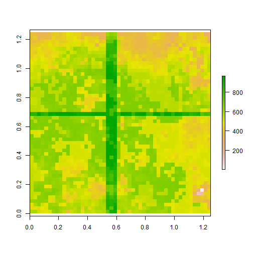\ 

Generate new gdist response surface by using `Run_gdistance` and run `gdsit.prep` to add response
```{r combine.cs, eval=FALSE }
# Create the true resistance/response surface
gdist.response <- Run_gdistance(gdist.inputs = gdist.inputs,
                                r = Resist)

gdist.inputs <- gdist.prep(n.Pops = length(sample.locales),
                           samples = sample.locales,
                           response = as.vector(gdist.response),
                           method = 'commuteDistance')
```

Run `MS_optim`. Running this multisurface example with the default settings took 215 iterations and ~42 minutes to complete on a computer with an Intel i7 3.6 GHz processor.
```{r eval=FALSE}
Multi.Surface_optim <- MS_optim(gdist.inputs = gdist.inputs,
                                GA.inputs = GA.inputs)
```

What the `MS_optim` function does:       
* Read all .asc files that are in the specified ASCII.dir (if using CIRCUITSCAPE), makes a raster stack, and determines whether each is a categorical or continuous surface. A surface is considered categorical if it contains 15 or fewer unique values. 
* Transformation and resistance values are chosen for each surface, all surfaces are added together, and chosen objective function is obtained from the mixed effects model.   
* Several summary outputs are generated   
 * In the 'Results' directory (i.e. Writedir), a final optimized resistance .asc file has been made (the name is a combination of the layers optimized, separated by "."), along with the CIRCUITSCAPE results (.out files) _OR_ gdistance results.   
 * 'Multisurface_Optim_Summary.txt' provides a text summary of the model parameters and results of the multisurface optimization  
 * A .csv file with the fitted MLPE model coefficients
 * A 'Percent_Contribution.csv' file is generated, reporting the mean and 95% CI of the contribution of each surface to the final composite resistance surface    
 * In the 'Plots' directory there is a 4-panel figure with different model diagnostic plots generated from the fitted mixed effects model of each optimized resistance surface.    
* The `GA` object from the optimization is returned and can be further explored.   

The multisurface optimization procedure has done a pretty good job of recovering the relative data generating values. You'll notice that we have not exactly recovered the values, but that the relative relationship among surfaces is preserved (see below).
```{r eval=FALSE}
Summary.table <- data.frame(PARM,round(t(Multi.Surface_optim$GA.summary@solution),2))
colnames(Summary.table)<-c("Truth", "Optimized")
row.names(Summary.table)<-c("Category1", "Category2", "Category3", 
                            "Transformation", "Shape", "Max",
                            "Feature1", "Feature2") 
```
```
Summary.table
               Truth Optimized
Category1        1.0      1.00
Category2      250.0    233.10
Category3       75.0     69.97
Transformation   1.0      1.50
Shape            3.5      3.45
Max            150.0    140.38
Feature1         1.0      1.00
Feature2       350.0    326.35
```     

If we rescale both the true and optimized resistance surfaces to have a minimum value of 1, we see that the surfaces are identical. The values for the 3-class categorical surface are the first three values listed, the continuous surface values = 4--6 , and the feature surface values = 7--8. Note that the first value for continuous surfaces identifies the transformation used (the fourth value, here), and is always rounded down (1 = Inverse-Reverse Monomolecular). Visualize and test the equivalence of simulated and optimized resistance surfaces:   
```{r combined.plots,fig.width=12,fig.height=8, eval=FALSE}
# Make combined, optimized resistance surface.
optim.resist <- Combine_Surfaces(PARM = Multi.Surface_optim$GA.summary@solution, 
                                 gdist.inputs = gdist.inputs,
                                 GA.inputs =  GA.inputs,
                                 rescale = TRUE)
ms.stack <- stack(Resist, optim.resist)
names(ms.stack) <- c("Truth", "Optimized")
plot(ms.stack) 

# Correlation between the two surfaces
pairs(ms.stack)
```
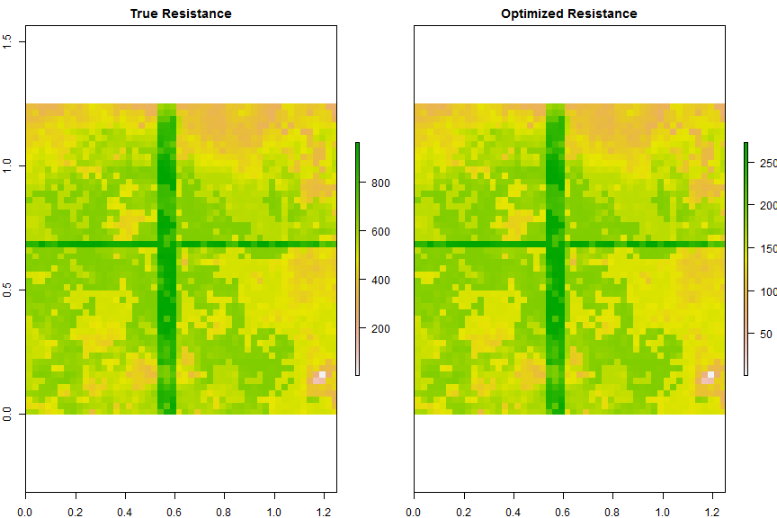     \

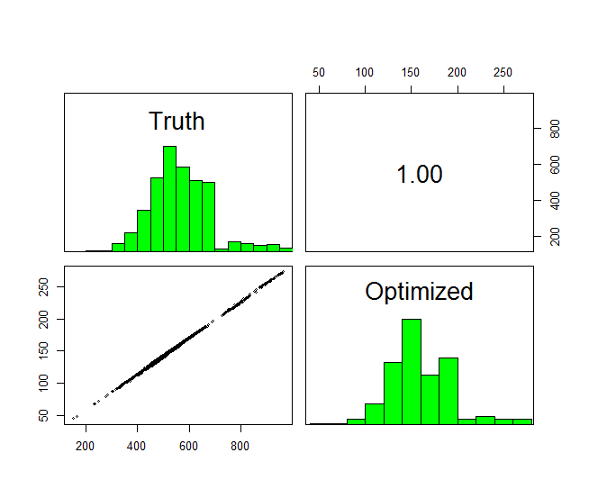       \


If you want to create a `CIRCUITSCAPE` current surface from either the true or optimized surfaces, this can be done by setting `CurrentMap = TRUE` and `output = "raster"` in `Run_CS`.
```{r CS.maps, eval=FALSE}
# Note: You must run `CS.prep` to generate the CS.inputs object for doing this.
CS.inputs <- CS.prep(n.Pops = length(sample.locales),
                     response = gdist.response,
                     CS_Point.File = paste0(write.dir,"samples.txt"),
                     CS.program = CS.program)

Resist.true <- Run_CS(CS.inputs = CS.inputs, 
                      GA.inputs = GA.inputs, 
                      r = Resist, 
                      CurrentMap = TRUE, 
                      output = "raster")

Resist.opt <- Run_CS(CS.inputs = CS.inputs, 
                     GA.inputs = GA.inputs,
                     r = optim.resist,
                     CurrentMap = TRUE, 
                     output = "raster")

# We can confirm that, like the resistance surfaces above, 
# the CIRCUITSCAPE current maps are also correlated
cs.stack <- stack(Resist.true, Resist.opt)
names(cs.stack) <- c("Truth", "Optimized")
pairs(cs.stack)
```
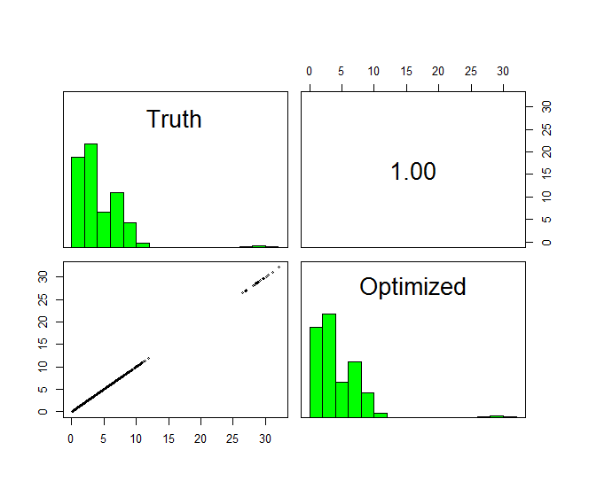 \

The optimization can converge on a highly correlated solution, but one that results in relative resistance values that are identical to those of the simulated data. This is important to understand, and interpretation of resistance values should be made with this fact in mind.        


# Optimization of a smoothing parameter
Scale is a central theme in landscape ecology, however it seems to be rarely or only indirectly addressed in landscape genetics studies. One way to assess 'scale' is to apply a kernel smoothing function to a continuous surface, or to a binary categorical surface. As of version 3.0-4, it is possible to set `scale = TRUE` in the `GA.prep` function. Doing so will apply a Gaussian kernel smoothing function to your resistance surface prior to applying a transformation. The `sigma` parameter is the standard deviation of the Gaussian kernel, and is measured in raster pixels (not map units).
```{r eval = FALSE}
data(resistance_surfaces)
cat <- resistance_surfaces[[1]]
cat[cat < 2] <- 0

# Make categorical surface binary
cat[cat == 2] <- 1

# Smooth and visualize
# The `SCALE` parameter re-scales the surface to 0-10
cat.smooth <- k.smooth(raster = cat,
                       sigma = 1,
                       SCALE = TRUE)
par(mfrow = c(1,2))
plot(cat, main = "Original")
plot(cat.smooth, main = "Smoothed, sigma = 1")
par(mfrow = c(1,1))
```
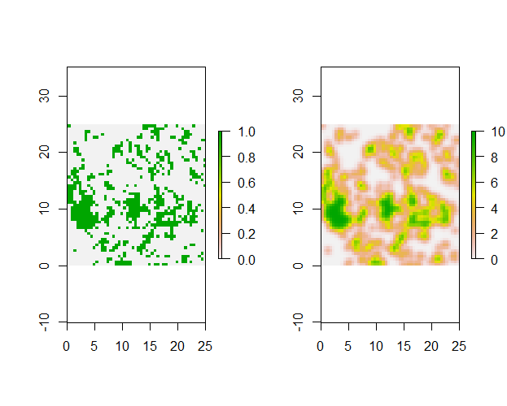 \

Run optimization to determine the transformation and smoothing parameters.
```{r k_smooth, eval=FALSE}
data(samples)
sample.locales <- SpatialPoints(samples[,c(2,3)])

# Set the random number seed to reproduce the results presented
# Run in parallel on 4 cores
# NOTE: `scale = TRUE` to indicate optimization of scaling/smoothing parameter
GA.inputs <- GA.prep(ASCII.dir = cat,
                     Results.dir = write.dir,
                     select.trans = "M",
                     scale = TRUE,
                     max.cat = 500,
                     max.cont = 500,
                     seed = 321,
                     run = 35,
                     parallel = 4) 

# Optimize using commute distance
gdist.inputs <- gdist.prep(n.Pops = length(sample.locales),
                           samples = sample.locales,
                           method = 'commuteDistance') 

# Transform resistance surface
r.tran_smooth <- Resistance.tran(transformation = "Monomolecular",
                                 shape = 2,
                                 max = 275, 
                                 r = cat.smooth) 

# Create the true resistance/response surface
gdist.response <- Run_gdistance(gdist.inputs = gdist.inputs,
                                r = r.tran_smooth)

# Rerun `gdist.prep` to include response
gdist.inputs <- gdist.prep(n.Pops = length(sample.locales),
                           response = as.vector(gdist.response),
                           samples = sample.locales,
                           method = 'commuteDistance')

# Run optimization: NOTE use of `SS_optim.scale` to optimize the smoothing parameter
SS_RESULTS.gdist_scale <- SS_optim.scale(gdist.inputs = gdist.inputs,
                                         GA.inputs = GA.inputs)
```

Assess optimized against truth 
```
SS_table <- data.frame(c("Monomolecular", 2.0, 275, 1),
                        t(SS_RESULTS.gdist_scale$ContinuousResults[c(9:12)]))
colnames(SS_table) <- c("Truth", "commuteDist.Optimized")

SS_table
                 Truth commuteDist.Optimized
Equation Monomolecular         Monomolecular
shape                2               2.10675
max                275              313.7279
scale                1             0.9916279

```
Not too bad! As previusly mentioned, the maximum value parameter seems to be the hardest to optimize precisely. Note that optimization with a scaling parameter can be done with single surfaces or with a multi-surface composite. However, make sure that only continuous or binary surfaces are included.

## Example Analysis
Below is an example analysis using the three raster surfaces and sample locations provided with `ResistanceGA`. The 'true' data generating surface in this example will be a combination of the categorical and transformed continuous surface. The feature surface will have no effect on the pairwise distances. This example will show how ResistanceGA can (1) be used for model selection; (2) determine the relative influence of each resistance surface within a composite or multisurface analysis. A full 'analysis' is presented below. Note that for the first time in the simulation of data, 'noise' is being added to make it more akin to empirical genetic data.

```{r analysis1, eval=FALSE}
data(samples)
data("resistance_surfaces")

# Create a spatial points object 
sample.locales <- SpatialPoints(samples[, c(2, 3)])

# Run `gdist.prep` & GA.prep
gdist.inputs <-  gdist.prep(n.Pops = length(sample.locales),
                            samples = sample.locales,
                            method = 'commuteDistance')

# This will be used again later
GA.inputs_NoFeature <- GA.prep(method = "LL",
                               ASCII.dir = resistance_surfaces[[-3]],
                               Results.dir = "C:/ResistanceGA_Examples/run2/",
                               max.cat = 500,
                               max.cont = 500,
                               seed = 555,
                               parallel = 4)

# The 'true' resistance surface will be the composite surface
# Combine resistance surfaces, omitting the feature surface
# Use an Inverse Ricker transformation of the continuous surface
# Inverse Ricker  = 8
PARM <- c(1, 250, 75, 8, 4, 150)

# Setting `p.contribution = TRUE` to see how each surface 
# contributes to the total resistance of the composite surface
# This is the 'true' resistance surface that the example 'response'
# data were generated from
Resist <- Combine_Surfaces(PARM = PARM,
                           gdist.inputs = gdist.inputs,
                           GA.inputs = GA.inputs_NoFeature,
                           out = NULL,
                           rescale = TRUE,
                           p.contribution = TRUE)

# Assess contribution of each surface
Resist$percent.contribution

```
```
      surface      mean         l95       u95
1 categorical 0.7162853 0.022074324 0.9951583
2  continuous 0.2837147 0.004841735 0.9779257
```
Here, the categorical surface is responsible for ~72% of the total landscape resistance, while the continuous surface is responsible for ~28%.


```{r analysis2, eval=FALSE}
# Create a subdirectory for results
dir.create(file.path("C:/ResistanceGA_Examples/","run1"))
dir.create(file.path("C:/ResistanceGA_Examples/","run2"))

# Turn response data into vector
gd.true <- Run_gdistance(gdist.inputs = gdist.inputs,
                         r = Resist$combined.surface) 

gd.true <- as.vector(gd.true)

# Add some noise to response
set.seed(321)
gd.response <- gd.true + rnorm(length(gd.true), 0, 7)

plot(gd.response ~ gd.true)
ecodist::mantel(gd.response ~ gd.true) # Mantel r = 0.68

# Correlation with distance
ecodist::mantel(gd.response ~ as.vector(dist(samples[, c(2, 3)]))) # Mantel r = 0.28
plot(gd.response ~ as.vector(dist(samples[, c(2, 3)])), xlab = "Euclidean distance")
```
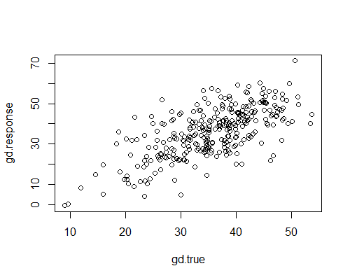\
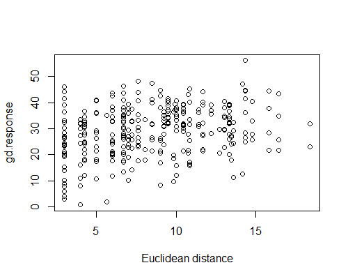\


```{r analysis2b, eval=FALSE}
# Re-run `gdist.prep` function
gdist.inputs <- gdist.prep(n.Pops = length(sample.locales),
                           response = gd.response,
                           samples = sample.locales)


# Re-run GA.prep to include all surfaces
GA.inputs_All <- GA.prep(method = "LL",
                               ASCII.dir = resistance_surfaces,
                               Results.dir =  "C:/ResistanceGA_Examples/run1/",
                               max.cat = 500,
                               max.cont = 500,
                               seed = 555,
                               parallel = 4)

# First run all single surfaces, Multi-surface is response variable
SS_RESULTS.gdist <- SS_optim(gdist.inputs = gdist.inputs,
                              GA.inputs = GA.inputs_All)

# Run `MS_optim` with all surfaces
Multi.Surface_optim.gd <- MS_optim(gdist.inputs = gdist.inputs,
                                   GA.inputs = GA.inputs_All)

# Run `MS_optim` with without Feature surface
Multi.Surface_optim.gd2 <- MS_optim(gdist.inputs = gdist.inputs,
                                    GA.inputs = GA.inputs_NoFeature)
```


What are the Percent contributions of individual surfaces to the combined surface?
```{r analysis3, eval=FALSE}
Multi.Surface_optim.gd$percent.contribution

Multi.Surface_optim.gd2$percent.contribution
```
```
> Multi.Surface_optim.gd$percent.contribution
      surface       mean         l95       u95
1 categorical 0.69442309 0.015257424 0.9936574
2  continuous 0.25750338 0.003547613 0.9665766
3     feature 0.04807353 0.002228049 0.3271122
> 
> Multi.Surface_optim.gd2$percent.contribution
      surface      mean         l95       u95
1 categorical 0.7162091 0.018947318 0.9962710
2  continuous 0.2837909 0.003729041 0.9810527
```
We can see that the feature surface has a minimal contribution to the total resistance, and that the mean contributions of the categorical and continuous surfaces are nearly identical to the 'true' contributions, especially when only these two surfaces are optimized together.

## Bootstrap Analysis
It is often the case that there is weak or ambiguous support for a single best resistance surface (i.e. similar AIC scores), as can be seen in the AIC table below. Based strictly on AIC or marginal R^2^, there really is no difference between the multisurface optimization with and without the feature surface included. If we account for the additional parameters (k) present when including the feature surface, AICc does pretty clearly suggest that the compostire surface without the feature is best supported.
```
                        Surface  obj.func_LL  k      AIC     AICc   R2m   R2c       LL
         categorical.continuous     -905.891  8 1819.783 1836.783 0.624 0.624 -905.891
                     categorical    -915.727  4 1839.455 1841.455 0.606 0.612 -915.727
 categorical.continuous.feature     -905.446 11 1818.894 1853.201 0.625 0.625 -905.446
                        Distance    -947.434  2 1902.868 1899.414 0.234 0.545 -947.434
                      continuous    -945.818  4 1899.636 1901.636 0.267 0.560 -945.818
                         feature    -947.417  3 1902.834 1901.977 0.237 0.550 -947.417
                            Null    -992.765  1 1991.531 1987.705 0.000 0.298 -992.765
```
Another approach that may lead to additional insight beyond the AIC(c) values generated during optimization is a bootstrap analysis using the `Resist.boot` function. This approach will assess the relative support for each optimized resistance surface through a 'pseudo'bootstrap where the sample locations/individuals as well as the resistance distance matrices are subsampled at each bootstrap iteration (without replacement), and the MLPE model is refit and the AIC scores calculated. Resistance surfaces are *NOT* re-optimized during this process. This analysis will assess the robustness of the optimized resistance surface given different combinations of samples. If the observed patterns in the resistance-genetics relationship are driven by one or a few sample locations, this analysis may reveal this. 
```{r boot, eval = F}
# Extract relevant components from optimization outputs
# Make a list of cost/resistance distance matrices
mat.list <- c(SS_RESULTS.gdist$cd,
              Multi.Surface_optim.gd$cd,
              Multi.Surface_optim.gd2$cd)

k <- rbind(SS_RESULTS.gdist$k,
           Multi.Surface_optim.gd$k,
           Multi.Surface_optim.gd2$k)

# Use 'response' data provided with package, 
# which is the square matrix of pairwise resistances
data("response")

# Run bootstrap
(AIC.boot <- Resist.boot(mod.names = names(mat.list),
                         dist.mat = mat.list,
                         n.parameters = k[,2],
                         sample.prop = 0.75,
                         iters = 1000,
                         obs = 25,
                         genetic.mat = response
)
)

```

```
                         surface   avg.R2m   avg.weight avg.rank     n Percent.top     k
                           <chr>     <dbl>        <dbl>    <dbl> <dbl>       <dbl> <dbl>
1         categorical.continuous 0.4536016 5.161502e-01    1.322   679        67.9     8
2 categorical.continuous.feature 0.4549328 4.277633e-01    1.708   315        31.5    11
3                    categorical 0.4306851 5.608608e-02    2.970     6         0.6     4
4                     continuous 0.1773572 1.842331e-07    4.075     0         0.0     4
5                        feature 0.1587058 7.339831e-08    5.437     0         0.0     3
6                       Distance 0.1612018 7.210663e-08    5.488     0         0.0     2
```
You can see that there is decent support for the composite surface that (incorrectly) includes the feature surface, but that in 68% of bootstrap samples, the composite without the feature surface was the top model.      


The model selection clearly suggests, correctly, that the multisurface combination with the categorical and continuous surface is the best. In looking at the full results output Further, if you assess the optimized values from this analysis, you can see that each surface was parameterized very well. The maximum resistance value of all surfaces was lower than the true surface, but overall this resulted in a nearly perfectly correlated surface (r = 1.00). It is worth noting that the optimized surface resulted in a marginal R^2^ = 0.62, suggesting that optimization with 'noisy' genetic data may not result in the highest R^2^ values, but that optimization can nonetheless reliably determine the effects of the landscape on pairwise genetic distance. 
```{r, eval = FALSE}
Summary.table <- data.frame(PARM,round(t(Multi.Surface_optim.gd2$GA.summary@solution),2))
colnames(Summary.table)<-c("Truth", "Optimized")
row.names(Summary.table)<-c("Category1", "Category2", "Category3", 
                            "Transformation", "Shape", "Max") 
```
```
> Summary.table
               Truth Optimized
Category1          1      1.00
Category2        250    334.23
Category3         75     86.07
Transformation     8      8.45
Shape              4      3.95
Max              150    171.22
```
```{r, eval = FALSE}
opt.r <- raster("C:/ResistanceGA_Examples/run2/Results/categorical.continuous.asc")
r.stack <- stack(Resist$combined.surface, opt.r) 
names(r.stack) <- c("Truth", "Optimized")

plot(r.stack)

pairs(r.stack)
```
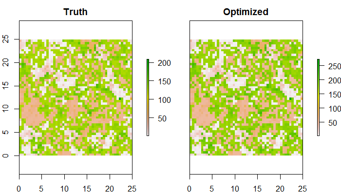\

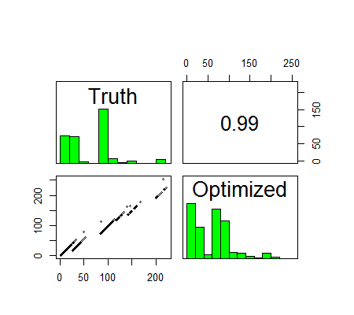\


**Comments on multiple surface optimization:**     
* If the optimized resistance values are near the maximum value specified in `GA.prep`, it is recommended that you increase the maximum value and rerun the optimization.  \
* If the optimization ends very quickly (e.g., <40 iterations), you may want to increase the probability of mutation (`pmutation`) and/or the probability of crossover (`pcrossover`). These can be adjusted using `GA.prep`. I have not extensively tested these settings to determine optimal values, but found that the current defaults (`pmutation = 0.125`, `pcrossover = 0.85`) have generally worked quite well with simulated data and produced reproducible estimates with real data. Alternatively, because this is a stochastic optimization, just rerun the optimization (**make sure you have not set a seed!**)\
* Any and all settings of the `ga` function can be adjusted or customized. The main change made from the default setting for optimization of resistance surfaces was to use the "gareal_blxCrossover" method. This greatly improved the search of parameter space.\
* As mentioned above concerning single surface optimization: this is a stochastic optimization process and optimized values will likely differ from run to run. Despite the time involved, it is advised to run all optimizations at least twice to confirm parameter estimates/relative relationship among resistance surfaces. \
* While there is no established framework for how optimization of resistances surface can or should be done, below is a flowchart of how an analysis might proceed:   

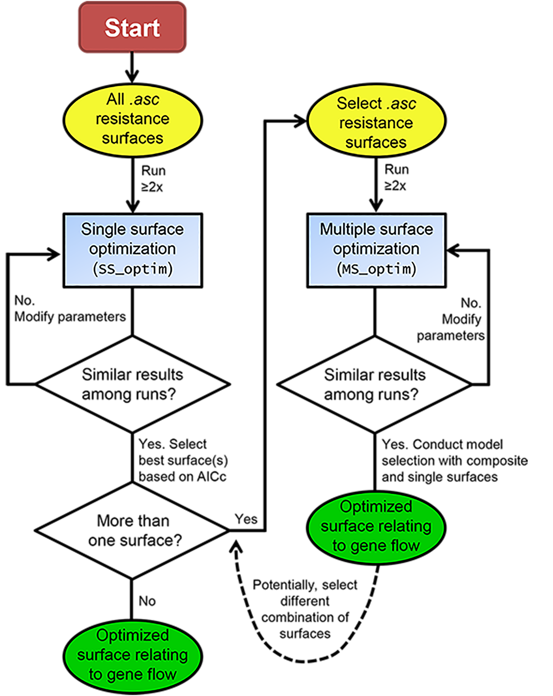 \


### Summary   
Hopefully this vignette/tutorial has demonstrated the functions present in this package and how they can be used together to optimize resistance surfaces in isolation or in combination. These methods require no *a priori* assumptions by the researcher. Optimization is conducted solely on the genetic distance data provided.  The goal of this package is to make these methods accessible and useful to others. Development and advancement will continue as long as there is interest and there remains a need. Please contact me (<bill.peterman@gmail.com>) if you encounter issues with any of these functions, need assistance with interpretation, or would like other features added.


### Acknowledgements
A huge thanks to Grant Connette for many discussions related to development and implementation of these methods!